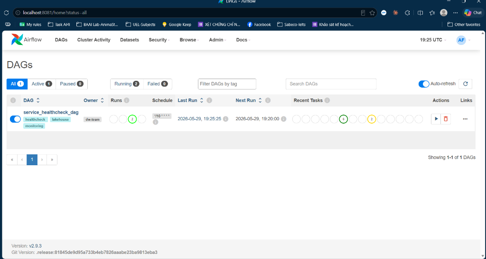

# The Modern Lakehouse Architecture

## Repository Structure

```
e2eLakehouse/
├── README.md
├── .env.example
├── docker-compose.yaml
├── docs/
│   └── images/
│       └── airflow-healthcheck-dag.png
└── docker/
    ├── airflow/
    │   ├── dags/
    │   │   └── service_healthcheck_dag.py
    │   └── logs/                            # Auto-generated, gitignored
    ├── dbt-spark/
    │   ├── Dockerfile
    │   └── entrypoint.sh
    ├── hive/
    │   └── hive-site.xml
    ├── postgres/
    │   └── init.sql
    ├── spark/
    │   ├── Dockerfile
    │   ├── download_jars.sh
    │   ├── spark-app/
    │   │   ├── create_schema.py
    │   │   └── ingest_bronze.py
    │   └── spark-config/
    │       ├── core-site.xml
    │       ├── hive-site.xml
    │       └── spark-defaults.conf
    └── trino/
        ├── catalog/
        │   └── iceberg.properties
        ├── config.properties
        ├── jvm.config
        ├── node.properties
        └── log.properties
```

---

## Layer Architecture

| Layer | Iceberg Schema | dbt Folder | Purpose |
|---|---|---|---|
| Bronze | `iceberg.bronze` | — (Spark ingestion) | Raw Northwind tables |
| Silver | `iceberg.silver` | `models/staging/` | Cleaned, typed staging models |
| Gold | `iceberg.gold` | `models/gold/` | Kimball Star Schema for reporting / ML |

---

## Quick Start

### Step 1 — Configure Environment

```bash
cp .env.example .env
```

### Step 2 — Start All Services

```bash
docker compose up -d --build
```

> **Note:** On Windows, if you encounter `not found` errors during the Spark build,
> ensure that shell scripts (`*.sh`) have **LF** line endings (not CRLF).

### Step 3 — Verify Services

```bash
docker compose ps
```

All services should show `running` status. The `airflow-init` and `create-minio-bucket`
containers will exit after completing their initialization tasks — this is expected.

### Step 4 — Create Iceberg Schema

```bash
docker exec -it spark-ingest spark-submit /opt/spark-app/create_schema.py
```

### Step 5 — Ingest Data into Bronze Layer

```bash
docker exec -it spark-ingest spark-submit /opt/spark-app/ingest_bronze.py
```

### Step 6 — Run dbt Transformations

Run all layers in order (silver → gold → ml):

```bash
# Run a specific layer only
docker exec -it dbt dbt run --select staging

# Run tests after each layer
docker exec -it dbt dbt test --select staging

# Run and test Gold layer (Star Schema)
docker exec -it dbt dbt run --select gold
docker exec -it dbt dbt test --select gold
```
---

## Web UI Access

| Service | URL | Credentials |
|---|---|---|
| **Airflow** | [http://localhost:8081](http://localhost:8081) | `airflow` / `airflow` |
| **MinIO Console** | [http://localhost:9001](http://localhost:9001) | `admin` / `admin123` |
| **Trino** | [http://localhost:8090](http://localhost:8090) | any username, no password |
| **Spark UI** | [http://localhost:4040](http://localhost:4040) | — |

---

## Trino Query Engine

Trino is configured as a single-node coordinator with an **Iceberg catalog** connected
to the Hive Metastore and MinIO. JVM heap is set to 512 MB for laptop-friendly usage.

### Connect to Trino CLI

```bash
docker exec -it trino trino
```

### Explore Catalogs and Schemas

```sql
-- List all catalogs
SHOW CATALOGS;

-- List all schemas in the iceberg catalog
SHOW SCHEMAS FROM iceberg;

-- List tables in each layer
SHOW TABLES FROM iceberg.bronze;

SHOW TABLES FROM iceberg.silver;
```

### Bronze Layer Queries

```sql
-- Raw ingested tables
SELECT * FROM iceberg.bronze.order_details LIMIT 10;
```

### Silver Layer Queries

```sql
-- Cleaned and typed staging models
SELECT * FROM iceberg.silver.stg_orders LIMIT 10;

-- Verify line revenue calculation
SELECT order_id, product_id, unit_price, quantity, discount, line_revenue
FROM iceberg.silver.stg_order_details
LIMIT 10;
```

---

## dbt Models

### Model Overview

```
dbt/models/
├── staging/        → silver layer (7 models)
│   ├── stg_customers.sql
│   ├── stg_orders.sql
│   ├── stg_order_details.sql
│   ├── stg_products.sql
│   ├── stg_categories.sql
│   ├── stg_employees.sql
│   └── stg_suppliers.sql
```

### Useful dbt Commands

```bash
# Check connection to Spark Thrift Server
docker exec -it dbt dbt debug

# Compile SQL without running (inspect generated SQL)
docker exec -it dbt dbt compile
```

---

## Airflow — Service Healthcheck DAG

This project includes an **Apache Airflow** setup with a DAG that monitors the health
of all lakehouse services.

### Overview

- **DAG ID:** `service_healthcheck_dag`
- **Schedule:** Every 10 minutes (`*/10 * * * *`)
- **Owner:** `dw-team`
- **Tags:** `monitoring`, `lakehouse`, `healthcheck`

### What It Monitors

| Task ID | Service | Method | Target |
|---|---|---|---|
| `check_postgres` | PostgreSQL (Northwind) | TCP socket | `northwind-db:5432` |
| `check_minio` | MinIO | HTTP GET | `http://minio:9000/minio/health/live` |
| `check_trino` | Trino | HTTP GET | `http://trino:8080/v1/info` |
| `check_spark` | Spark | HTTP GET | `http://spark:8080` (fallback: `:4040`) |

All 4 tasks run **in parallel** (no dependency between them).

### Airflow Architecture (Docker)

| Container | Role |
|---|---|
| `airflow-db` | PostgreSQL 15 — Airflow metadata database (port `5434`) |
| `airflow-init` | Runs `airflow db migrate` + creates admin user, then exits |
| `airflow-webserver` | Airflow Web UI on port `8081` |
| `airflow-scheduler` | Executes DAGs on schedule |

### Usage After Cloning

1. **Clone the repository and start services:**

   ```bash
   git clone https://github.com/CkoThuw11/e2eLakehouse.git
   cd e2eLakehouse
   cp .env.example .env
   docker compose up -d --build
   ```

2. **Wait for initialization** (~30-60 seconds for `airflow-init` to complete):

   ```bash
   docker compose logs airflow-init --tail 5
   ```

3. **Access Airflow UI:**
   - Open [http://localhost:8081](http://localhost:8081)
   - Login: **username** = `airflow`, **password** = `airflow`

4. **Enable the DAG:**
   ```bash
   docker exec -it airflow-scheduler airflow dags unpause service_healthcheck_dag
   ```

5. **Trigger a manual run** (optional):

   ```bash
   docker exec -it airflow-scheduler airflow dags trigger service_healthcheck_dag
   ```

6. **Verify the DAG is registered:**

   ```bash
   docker exec -it airflow-scheduler airflow dags list
   ```

7. **Check for import errors:**

   ```bash
   docker exec -it airflow-scheduler airflow dags list-import-errors
   ```

### Proof of Successful Execution



---

## MinIO Warehouse Layout

Expected warehouse structure after all layers are populated:

```text
warehouse/
├── bronze/
│   ├── categories/
│   ├── customers/
│   ├── employees/
│   ├── orders/
│   ├── order_details/
│   ├── products/
│   └── suppliers/
├── silver/
│   ├── stg_customers/
│   ├── stg_orders/
│   ├── stg_order_details/
│   ├── stg_products/
│   ├── stg_categories/
│   ├── stg_employees/
│   └── stg_suppliers/
├── gold/
│   ├── dim_customers/
│   ├── dim_date/
│   ├── dim_employees/
│   ├── dim_products/
│   └── fact_sales/
```

Each Iceberg table contains:

```text
<table_name>/
├── metadata/
└── data/
```