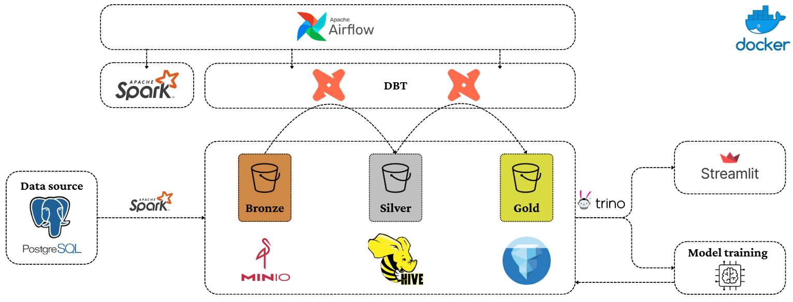
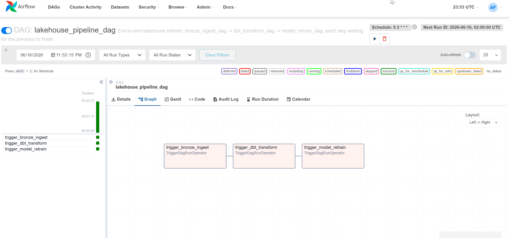
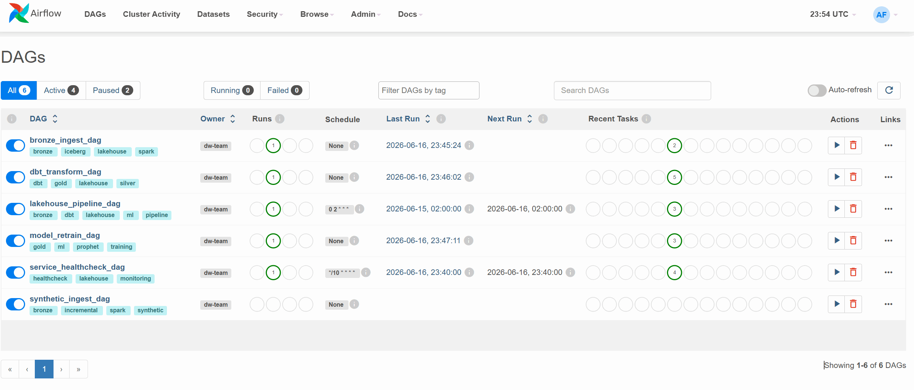
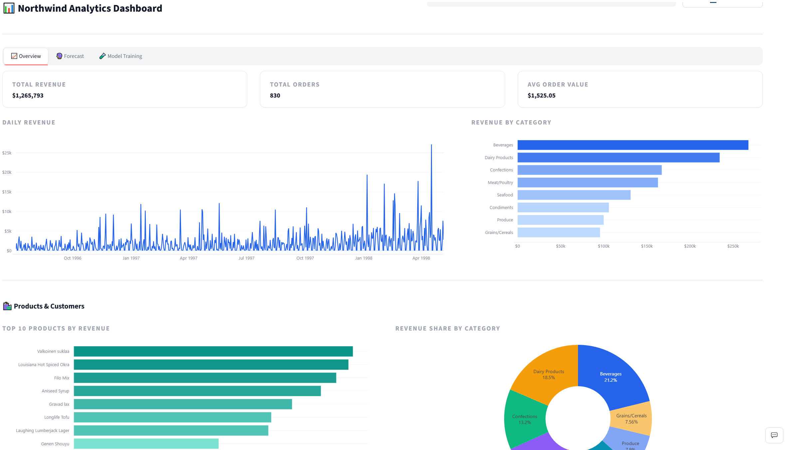
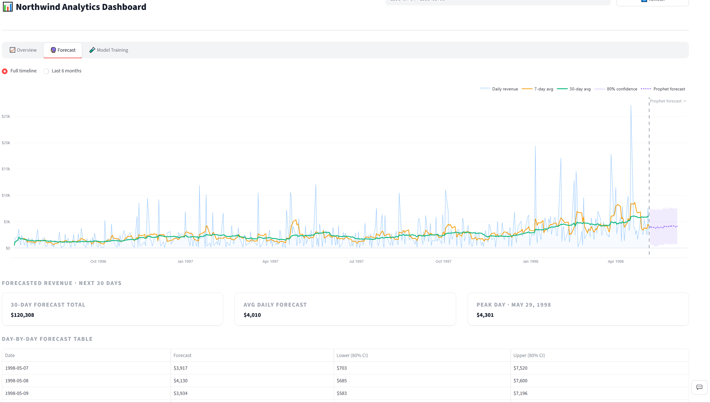
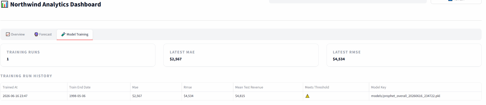
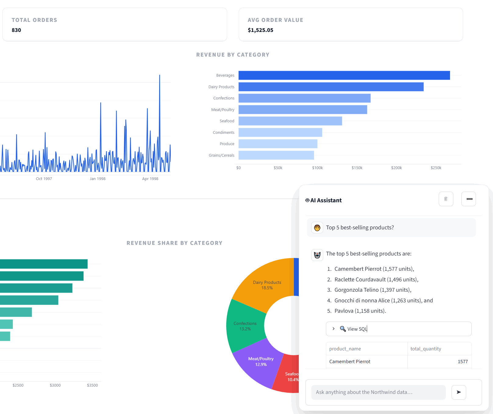
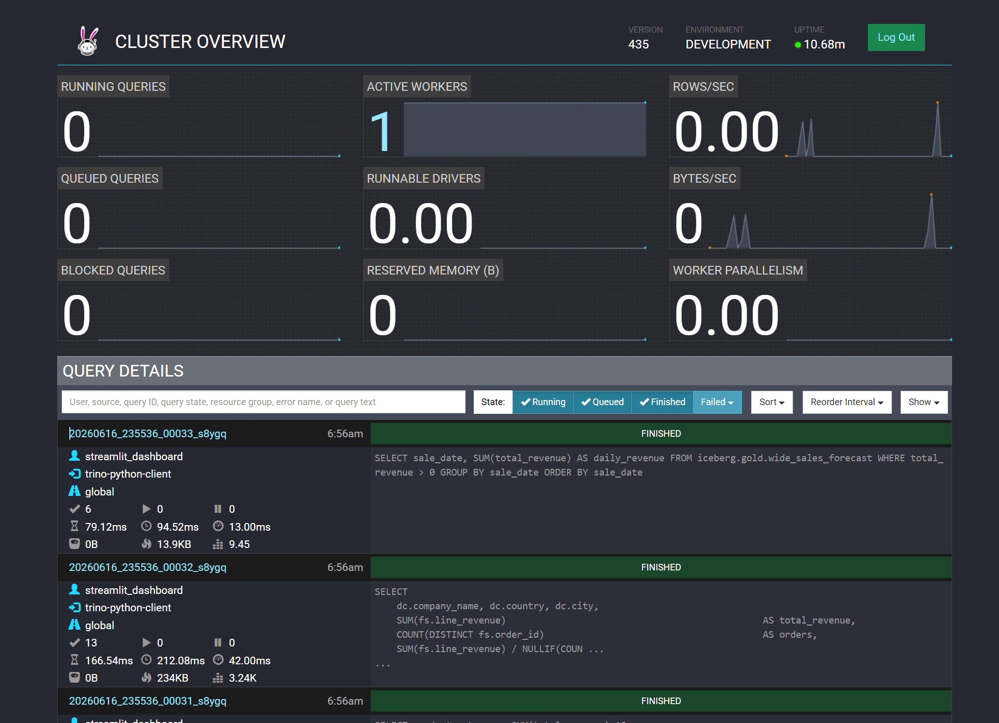
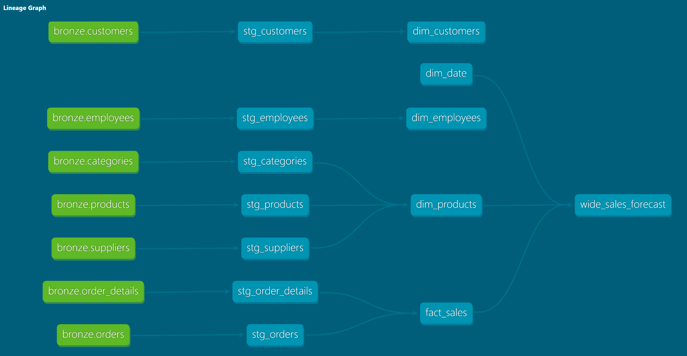
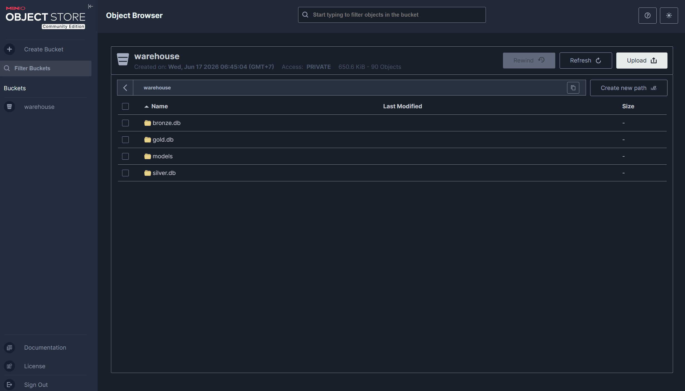

# 🏞️ Northwind Lakehouse

End-to-end data lakehouse built on Apache Iceberg + Spark + Trino, with dbt transformations, a Prophet forecasting model, Airflow orchestration (parent pipeline + child DAGs), a Streamlit analytics dashboard, and a Groq-powered text-to-SQL agent.

## 📑 Contents

- [🏗️ Architecture](#️-architecture)
- [🐳 Services](#-services)
- [📁 Repository Layout](#-repository-layout)
- [🚀 Quick Start](#-quick-start)
- [🔗 Service URLs](#-service-urls)
- [🌬️ Airflow](#️-airflow)
- [📊 Streamlit Dashboard](#-streamlit-dashboard)
- [🤖 Groq AI Agent (Text-to-SQL)](#-groq-ai-agent-text-to-sql)
- [🔮 Prophet Forecasting](#-prophet-forecasting)
- [🔍 Trino](#-trino)
- [🧱 dbt Models](#-dbt-models)
- [🗄️ MinIO Warehouse Layout](#️-minio-warehouse-layout)
- [🙏 Acknowledgments](#-acknowledgments)

---

## 🏗️ Architecture


*End-to-end flow: PostgreSQL → Spark (Bronze) → dbt (Silver/Gold) → Trino → {Streamlit, Groq Agent}, orchestrated by Airflow, with MinIO + Hive Metastore as the storage layer.*

| Layer  | Iceberg Schema   | Tool                   | Purpose                                   |
| ------ | ---------------- | ---------------------- | ----------------------------------------- |
| Bronze | `iceberg.bronze` | Spark                  | Raw Northwind tables                      |
| Silver | `iceberg.silver` | dbt `models/staging/`  | Cleaned, typed staging models             |
| Gold   | `iceberg.gold`   | dbt `models/gold/`     | Star schema — dims, fact, wide ML table   |

The Hive Metastore stores Iceberg table metadata; MinIO (`warehouse/` bucket) stores the actual Parquet files plus serialized Prophet models. Trino, Spark, and dbt all point at the same Hive Metastore + MinIO.

---

## 🐳 Services

Everything runs from a single `docker-compose.yaml` on a shared `data-network`:

| Container               | Role                                                   |
| ----------------------- | ------------------------------------------------------ |
| `northwind-db`          | PostgreSQL source — seeded Northwind tables            |
| `metastore-db`          | PostgreSQL backing the Hive Metastore                  |
| `hive-metastore`        | Iceberg metadata catalog                               |
| `minio` + `create-minio-bucket` | S3-compatible object store (`warehouse/`)      |
| `spark-ingest`          | Spark driver for bronze + synthetic ingest jobs        |
| `spark-thrift-server`   | Spark Thrift endpoint (for ad-hoc Spark SQL)           |
| `dbt`                   | dbt-spark adapter for silver + gold transforms         |
| `trino`                 | Query engine over Iceberg on MinIO                     |
| `airflow-db` + `airflow-init` | Airflow metadata DB and one-shot init           |
| `airflow-scheduler` / `airflow-webserver` / `airflow-triggerer` | Airflow control plane    |
| `streamlit-dashboard`   | Analytics dashboard with embedded AI assistant         |
| `groq-agent`            | Text-to-SQL CLI (also imported by the dashboard)       |

---

## 📁 Repository Layout

```
e2eLakehouse/
├── .env.example
├── docker-compose.yaml
├── dbt/
│   ├── models/staging/        → 7 silver models
│   └── models/gold/           → 4 dims + 1 fact + 1 wide forecast table
├── notebook/                  → forecasting EDA notebook
├── models/prophet/            → local copy of trained Prophet artifacts
└── docker/
    ├── agent/                 → Groq text-to-SQL CLI (also imported by Streamlit)
    ├── airflow/dags/          → 6 DAGs (see Airflow section)
    ├── dbt-spark/             → dbt + Spark adapter image
    ├── hive/                  → Hive Metastore image
    ├── ml/train_prophet.py    → Prophet training script
    ├── postgres/              → Northwind seed SQL
    ├── spark/spark-app/       → bronze + synthetic ingest scripts
    ├── streamlit/             → dashboard (app.py + data.py + chat.py)
    └── trino/                 → Trino coordinator config
```

---

## 🚀 Quick Start

### 1. Configure environment

```bash
cp .env.example .env
# Add your Groq key so the AI agent works:
# GROQ_API_KEY=<key from https://console.groq.com>
```

### 2. Start all services

```bash
docker compose up -d --build
docker compose ps   # airflow-init and create-minio-bucket exit 0 — expected
```

> **Windows / WSL:** if Spark build fails with `not found` errors, ensure `*.sh` files have **LF** line endings (not CRLF).

### 3. Run the pipeline end-to-end (recommended)

The parent DAG `lakehouse_pipeline_dag` does **bronze ingest → dbt silver/gold → Prophet retrain** in order:

```bash
docker exec -it airflow-scheduler airflow dags trigger lakehouse_pipeline_dag
```

It runs once a day on its own (`0 2 * * *`); the command above just triggers it immediately. Once it finishes, open the [Streamlit dashboard](http://localhost:8501).

### Manual fallback (per-step)

Useful when debugging a single layer.

```bash
# Iceberg schemas (one-time)
docker exec -it spark-ingest spark-submit /opt/spark-app/create_schema.py

# Bronze
docker exec -it spark-ingest spark-submit /opt/spark-app/ingest_bronze.py

# Silver + Gold
docker exec -it dbt dbt deps
docker exec -it dbt dbt run  --select staging
docker exec -it dbt dbt test --select staging
docker exec -it dbt dbt run  --select gold
docker exec -it dbt dbt test --select gold
```

---

## 🔗 Service URLs

| Service             | URL                       | Credentials                |
| ------------------- | ------------------------- | -------------------------- |
| Airflow             | http://localhost:8081     | `airflow` / `airflow`      |
| MinIO Console       | http://localhost:9001     | `admin` / `admin123`       |
| Trino UI            | http://localhost:8090     | any username, no password  |
| Streamlit Dashboard | http://localhost:8501     | —                          |

---

## 🌬️ Airflow

Airflow runs three Python processes: `airflow-scheduler`, `airflow-webserver`, and `airflow-triggerer`. The triggerer is required so the parent pipeline can wait on its children using `deferrable=True` operators (no worker slot is held during the wait, and waits survive scheduler restarts).


*Graph view of `lakehouse_pipeline_dag` — bronze → dbt → model retrain, chained via deferrable `TriggerDagRunOperator`.*

### DAGs

| DAG ID                    | Schedule          | Purpose                                                                                  |
| ------------------------- | ----------------- | ---------------------------------------------------------------------------------------- |
| `lakehouse_pipeline_dag`  | `0 2 * * *` daily        | **Parent orchestrator.** Triggers bronze → dbt → model retrain in order, waiting on each child via deferrable `TriggerDagRunOperator`. |
| `bronze_ingest_dag`       | on-demand (parent / CLI) | Creates Iceberg schemas, then `spark-submit`s `ingest_bronze.py`.                       |
| `dbt_transform_dag`       | on-demand (parent / CLI) | `dbt deps` → silver run/test → gold run/test.                                           |
| `model_retrain_dag`       | on-demand (parent / CLI) | Retrains the Prophet forecasting model from `iceberg.gold.wide_sales_forecast` and writes the new pickle + metrics JSON to MinIO. |
| `synthetic_ingest_dag`    | on-demand (CLI / UI)     | Appends synthetic Northwind orders to bronze, then re-triggers `dbt_transform_dag` and `model_retrain_dag`. Useful for demo / stress testing. |
| `service_healthcheck_dag` | `*/10 * * * *`           | Parallel reachability checks for PostgreSQL, MinIO, Trino, and Spark.                   |

The three pipeline children (`bronze_ingest_dag`, `dbt_transform_dag`, `model_retrain_dag`) have `schedule_interval=None` and `is_paused_upon_creation=False` — they sit **unpaused but idle**, only running when the parent (or you, manually) triggers them. This avoids race conditions between scheduled child runs and parent-triggered runs.


*All 6 DAGs in the Airflow UI with their schedules and last-run status.*

### Common commands

```bash
# Trigger the full pipeline manually
docker exec -it airflow-scheduler airflow dags trigger lakehouse_pipeline_dag

# Enable the healthcheck DAG (only DAG that needs to be unpaused explicitly)
docker exec -it airflow-scheduler airflow dags unpause service_healthcheck_dag

# Inspect runs
docker exec -it airflow-scheduler airflow dags list-runs -d lakehouse_pipeline_dag
```

---

## 📊 Streamlit Dashboard

Live analytics dashboard connected to `iceberg.gold` via Trino. Starts automatically with `docker compose up`. All Trino queries are cached with a 1-hour TTL; a date range filter at the top of the page drives every chart.


*Overview tab — KPIs, daily revenue, category breakdown, top products and customers.*

The dashboard is split across three files for clarity:

| File       | Responsibility                                                                      |
| ---------- | ----------------------------------------------------------------------------------- |
| `app.py`   | Page config, global CSS, header (title + date filter + refresh), tab orchestration. |
| `data.py`  | Trino query helpers + MinIO Prophet model / training-history loaders.               |
| `chat.py`  | Floating AI assistant FAB and chat panel.                                           |

| Tab               | Content                                                                                  |
| ----------------- | ---------------------------------------------------------------------------------------- |
| Overview          | Revenue / orders / AOV KPIs · daily revenue chart · revenue by category · top products · category share · top customers. |
| Forecast          | Historical revenue + 7/30-day rolling averages, overlaid with the Prophet 30-day forecast (or a linear fallback if no model is trained yet). |
| Model Training    | Training run history pulled from MinIO (`models/metrics_overall_*.json`), latest MAE / RMSE, threshold flag. |


*Forecast tab — historical revenue + 7/30-day rolling averages overlaid with the Prophet 30-day forecast.*


*Model Training tab — run history with MAE / RMSE and threshold check.*

The floating AI assistant in the bottom-right corner wraps the Groq agent (see below) inside the dashboard.


*The 💬 floating assistant — same Groq agent as the CLI, embedded in the dashboard.*

---

## 🤖 Groq AI Agent (Text-to-SQL)

CLI agent and Streamlit component that converts natural language into SQL via the Groq API (LLaMA 3.3 70B), validates that the SQL is read-only, executes it on Trino, and returns a plain-language answer.

**Flow:** `question → Groq (generate SQL) → sql_guard (SELECT-only) → Trino → Groq (format answer) → reply`

If SQL fails, the agent retries once with the error fed back to the model. The `sql_guard` module rejects anything that isn't a single `SELECT` — do not bypass it when extending the agent.

```bash
# Run 5 sample questions
docker compose run --rm groq-agent

# Single question
docker compose run --rm groq-agent python main.py -q "Top 5 products last month?"

# Interactive REPL
docker compose run --rm groq-agent python main.py --interactive

# Tests
docker compose run --rm groq-agent pytest
```

Inside the Streamlit dashboard, click the 💬 button in the bottom-right corner to open the assistant. It shares the same `agent/` package as the CLI.

---

## 🔮 Prophet Forecasting

The forecasting model is trained from `iceberg.gold.wide_sales_forecast` by `docker/ml/train_prophet.py`, orchestrated by `model_retrain_dag`. Each successful run uploads three artifacts to MinIO:

- `models/prophet_overall_<timestamp>.pkl` — pickled Prophet model.
- `models/metrics_overall_<timestamp>.json` — MAE, RMSE, threshold check, etc.
- `models/latest_overall.txt` — pointer to the most recent pickle.

The Streamlit Forecast tab reads `latest_overall.txt`, loads the pinned pickle, and overlays a 30-day forecast on the historical revenue chart. The Model Training tab paginates the metrics history.

A local copy of artifacts also lives under `models/prophet/` (gitignored), and exploratory work is in `notebook/forecasting_eda.ipynb`.

---

## 🔍 Trino

Single-node coordinator with an Iceberg catalog backed by Hive Metastore and MinIO.


*Trino Web UI at `http://localhost:8090` showing recent queries against `iceberg.gold`.*

```bash
# CLI
docker exec -it trino trino

# Explore
SHOW SCHEMAS FROM iceberg;
SHOW TABLES FROM iceberg.gold;

# Sample queries
SELECT * FROM iceberg.bronze.order_details LIMIT 10;
SELECT * FROM iceberg.gold.fact_sales       LIMIT 10;
SELECT sale_date, product_category, total_revenue
FROM iceberg.gold.wide_sales_forecast
ORDER BY sale_date DESC LIMIT 20;
```

See `README_Trino.md` for additional Trino setup notes.

---

## 🧱 dbt Models

```
models/staging/          models/gold/
├── stg_customers        ├── dim_customers
├── stg_orders           ├── dim_products
├── stg_order_details    ├── dim_employees
├── stg_products         ├── dim_date
├── stg_categories       ├── fact_sales
├── stg_employees        └── wide_sales_forecast
└── stg_suppliers
```

| Table                 | Grain                                                       |
| --------------------- | ----------------------------------------------------------- |
| `dim_customers`       | 1 row per customer                                          |
| `dim_products`        | 1 row per product (includes category & supplier)            |
| `dim_employees`       | 1 row per employee                                          |
| `dim_date`            | 1 calendar day                                              |
| `fact_sales`          | 1 row per order line item                                   |
| `wide_sales_forecast` | 1 row per day × category with 7/30-day rolling revenue sums |

dbt runs inside the `dbt` container; `profiles.yml` is committed and targets the in-cluster Trino at `trino:8080`.


*dbt lineage graph — staging models flowing into the gold star schema.*

---

## 🗄️ MinIO Warehouse Layout

```
warehouse/
├── bronze/   (categories, customers, employees, orders, order_details, products, suppliers)
├── silver/   (stg_customers, stg_orders, stg_order_details, stg_products, stg_categories, stg_employees, stg_suppliers)
├── gold/     (dim_customers, dim_products, dim_employees, dim_date, fact_sales, wide_sales_forecast)
└── models/   (prophet_overall_*.pkl, metrics_overall_*.json, latest_overall.txt)
```


*MinIO console — the `warehouse/` bucket showing the bronze / silver / gold / models layout.*

---

## 🙏 Acknowledgments

We would like to express our sincere gratitude to **Mr. Thon-Da Nguyen** for his guidance, mentorship, and continuous support throughout the development of this project. His insights into modern data lakehouse architecture, hands-on feedback during each layer of the pipeline (Bronze → Silver → Gold), and encouragement to explore tools like Apache Iceberg, Trino, dbt, Airflow, and LLM were invaluable in shaping the final outcome.

This project would not have been possible without his patience and dedication to helping us learn end-to-end data engineering by building, not just by reading.
