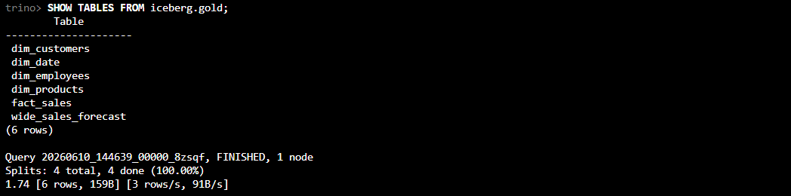
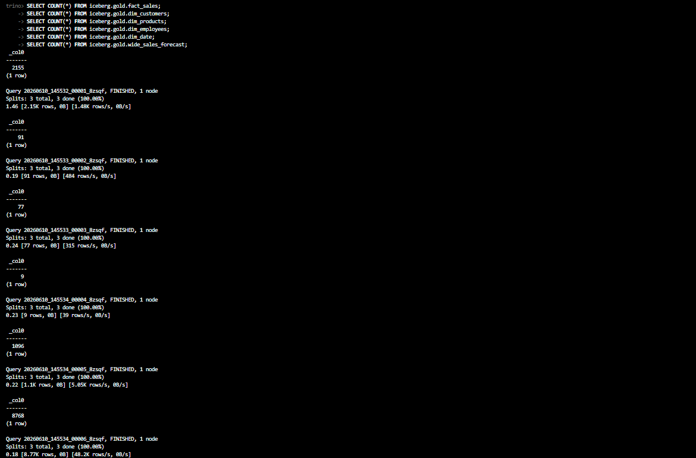
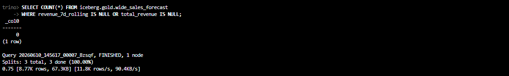
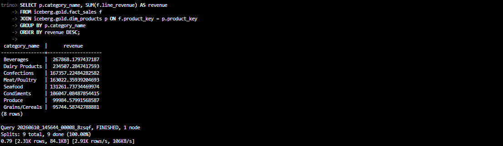
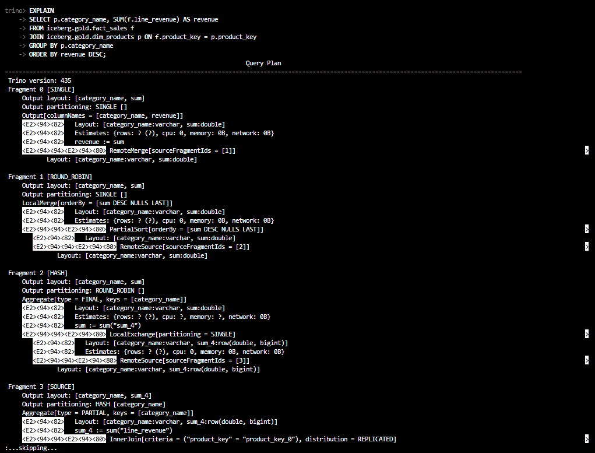

## Gold Layer Validation via Trino

### Gold Tables Verification

### Row Count Validation

### Data Quality Check

### Revenue Join Query

### Query Plan

### Query Latency Baseline

| Validation Step | Query Type | Latency (s) |
|-----------------|------------|------------:|
| Gold Catalog Verification | SHOW TABLES FROM iceberg.gold | 1.74 |
| Row Count Validation | fact_sales | 1.46 |
| Row Count Validation | dim_customers | 0.19 |
| Row Count Validation | dim_products | 0.24 |
| Row Count Validation | dim_employees | 0.23 |
| Row Count Validation | dim_date | 0.22 |
| Row Count Validation | wide_sales_forecast | 0.18 |
| Data Quality Check | Null Validation | 0.75 |
| Performance Test | Revenue Join Query | 0.79 |

### Validation Summary

| Check | Status |
|---------|---------|
| Gold tables registered | ✅ |
| All row counts > 0 | ✅ |
| Null check passed | ✅ |
| Join query executed successfully | ✅ |
| Query plan generated | ✅ |
| Latency baseline recorded | ✅ |

**Result:** All Gold Layer tables are accessible through Trino via the Iceberg catalog. Data quality validation passed successfully and query performance baselines have been recorded for downstream analytics and ML workloads.